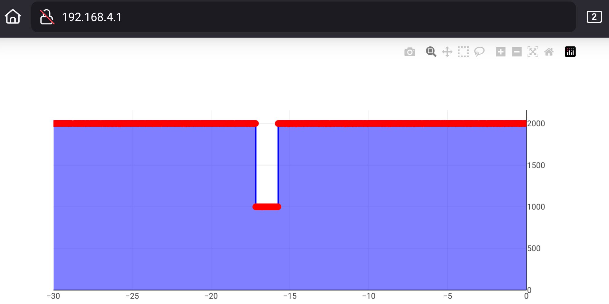

ESP32-based Wi-Fi pulse monitor
===

TODO
---

- Add installation steps to README
- Add demo.gif
- Have ChatGPT rewrite README
- Clear git history (file path in index.html, ...)

This is an easy-to-use tool that makes it easy to troubleshoot problems with signals at a distance (*ie* PWM in a moving
robot, ...), using any device equipped with a web browser.

Each point on the graph is set as follows:

- Its X coordinate is the time of the rising edge of the pulse
- Its Y coordinate is the time spent at HIGH level after the rising edge
  The interval between the X coordinates of two successive points gives the total duration of a cycle (cycle being
  defined as: rising edge, high state, falling edge, low state).

This tool is particularly adapted if you need to monitor the evolution of PWM signals over time, but can also be used
with longer pulses.

The visualisation can be paused and zoomed in, and the coordinates of each point can be accessed independently.

Installation
---

Limitations
---

- As of today, only one signal input (pin D13) is available.
- Only digital pulses are handled. For analog signals, have a look at
  [this impressive project](https://github.com/BojanJurca/Esp32_oscilloscope).
- Even though it runs entirely in a browser, the visualisation is not reactive enough on Windows 11 (requires further
  testing).

Example
---
Tested with an ESP32-WROOM-32 Dev Module.

PWM signal was connected to pin D13 (with common GND reference).
The signal's HIGH duration for each cycle dropped at 1000µs approx. 17s before screenshot time, and was at 2000µs the
rest of the time.

Dependencies
---
This project uses [Plotly JavaScript Open Source Graphing Library](https://plotly.com/javascript/) (under MIT licence)
for displaying
graphs.

Context
---
First developed for [X-Craft](https://www.x-craft.co.nz/), and made available for public use with their approbation.

