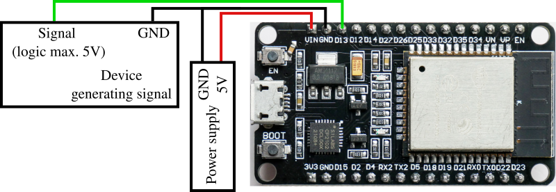
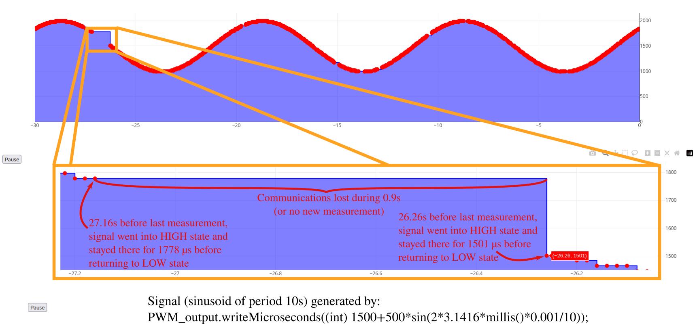
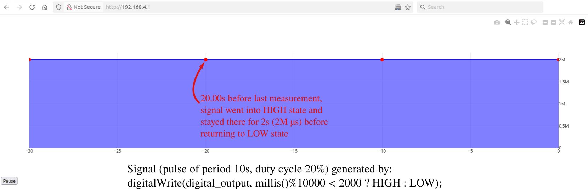
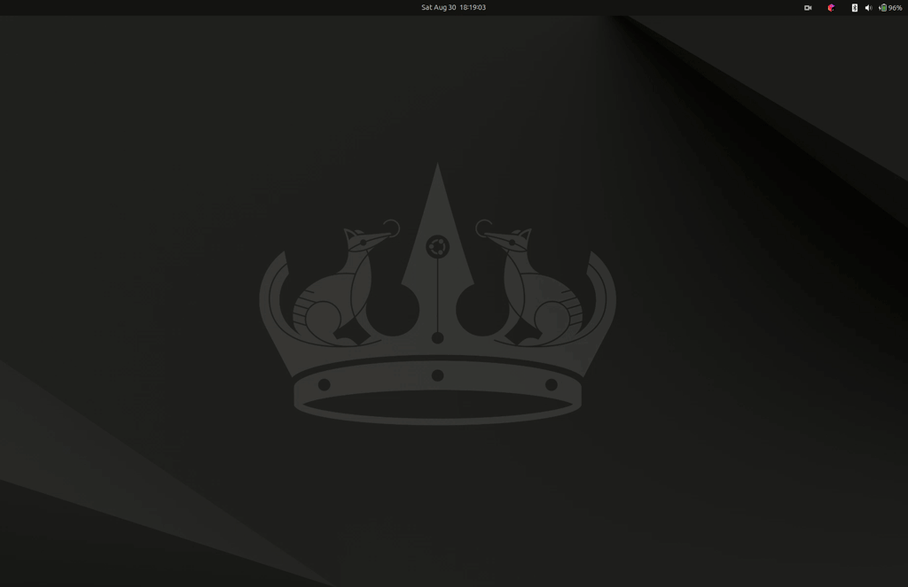

ESP32-based Wi-Fi pulse monitor
===

This is an easy-to-use tool that makes it easy to troubleshoot problems with signals at a distance (*ie* PWM in a moving
robot, ...), using any device equipped with a web browser.

Each point on the graph is set as follows:

- Its X coordinate is the time of the rising edge of the pulse
- Its Y coordinate is the time spent at HIGH level after the rising edge
  The interval between the X coordinates of two successive points gives the total duration of a cycle (cycle being
  defined as: rising edge, high state, falling edge, low state).

This tool is particularly adapted if you need to monitor the evolution of PWM signals over time, but can also be used
with longer pulses.

The visualisation can be paused and zoomed in, and the coordinates of each point can be accessed independently.

Installation
---
For a better understanding, you can
follow [this tutorial on Random Nerds Tutorials](https://randomnerdtutorials.com/esp32-web-server-littlefs/).

In short:

- Install [Arduino IDE 2](https://docs.arduino.cc/software/ide/#ide-v2)
- Install ESP32 board in Arduino IDE 2:
    - Go to *Boards Manager* (left side of Arduino IDE)
    - Type ESP32 in the research bar
    - Install *esp32 by Espressif Systems*
    - If the library is not listed there, go to `File > Preferences > Additional boards manager URLs` and add
      `https://raw.githubusercontent.com/espressif/arduino-esp32/gh-pages/package_esp32_index.json` to the list
      (edit using the button on the right-hand side), then retry the first 3 steps.
- Install the LittleFS plugin for Arduino IDE 2:
    - Go to [the releases page](https://github.com/earlephilhower/arduino-littlefs-upload/releases) and download the
      *.vsix* archive from the latest version.
    - Find the `.arduinoIDE` directory on your computer. It should be in your *home directory*, *i.e.*
      `C:\Users\<username>\.arduinoIDE\` on Windows, `~/.arduinoIDE/` on Ubuntu, macOS, ...
    - If does not already exist, create a `plugins` directory under `.arduinoIDE`.
    - Place the LittleFS *.vsix* archive inside the `plugins` directory.
    - Restart Arduino IDE 2 and press [Ctrl] + [Shift] + [P] to open the command palette. An instruction called
      `Upload LittleFS to Pico/ESP8266/ESP32` should be listed there.
- Using the *Library Manager* inside Arduino IDE 2 (left-hand side), install
  [ArduinoJson by Benoit Blanchon](https://arduinojson.org/).
- Download this project on your computer and open `pulse_monitor.ino` with Arduino IDE 2. Do not modify the project
  structure.
- Connect your board and select the right model (`ESP32 Dev Module` should do) and port. Check in the `Tools` menu
  that the board's specs are correct.
- Close any serial monitor linked to your board, if you opened any.
- Press [Ctrl] + [Shift] + [P], search for `Upload LittleFS to Pico/ESP8266/ESP32` and click on it. The files in the
  `pulse_monitor` directory will be transferred to your ESP32 after a few seconds, after which the application should
  be running.
- Click the `Upload` button. This will compile `pulse_monitor.ino` and replace the program that runs on the board.

Usage
---

- Power the ESP32, either via the USB connector or the GPIO (check your board's requirements).
- The ESP32 is based on 3.3V logic, but is 5V-compatible for digital inputs. Make sure your signal will never exceed
  that limit before connecting.
- Connect the reference of your signal to a GND pin of your board.
- Connect the signal wire to GPIO 13 (you can change the INPUT_PIN in `pulse_monitor.ino`).
- Connect your computer or mobile phone to the Wi-Fi hotspot generated by the ESP32 (SSID ESP32-AP, no password).
- Open a browser and type `192.168.4.1` in the address bar. The page may take a few seconds to load, after which you
  should see a graph. If the signal wire conveys pulses, you should be able to monitor them.

Examples
---
Tested with an ESP32-WROOM-32 Dev Module, powered with 6V on Vin pin, receiving signals with 3.3V logic.

PWM signal was connected to pin D13 (with common GND reference).

Limitations
---

- As of today, only one signal input (pin D13) is available.
- Only digital pulses are handled. For analog signals, have a look at
  [this awesome project](https://github.com/BojanJurca/Esp32_oscilloscope).
- Even though it runs entirely in a browser, the visualisation is not reactive enough on Windows 11 (requires further
  testing).
- Though the displayed resolution is 1µs, the precision of measures should not be expected to be better than a few
  microseconds.

Dependencies
---

- This project uses [Plotly JavaScript Open Source Graphing Library](https://plotly.com/javascript/) (under MIT licence)
  for displaying graphs.
- This project uses [ArduinoJson by Benoit Blanchon](https://arduinojson.org/) (under MIT licence)
  for the transmission of data between client and server.

Context
---
First developed for [X-Craft](https://www.x-craft.co.nz/), and made available to public with their approbation.

